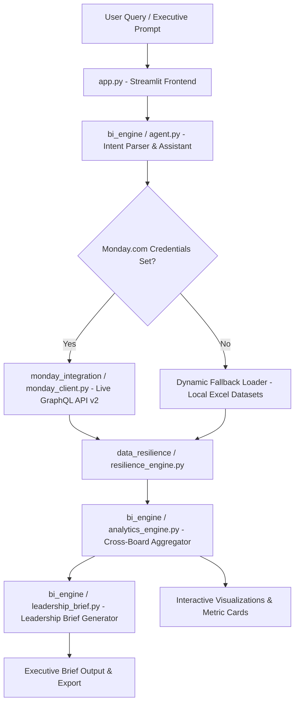

# 🛸 Skylark Drones - Monday.com Business Intelligence Agent

An intelligent, resilient Business Intelligence AI Agent designed for founders and executives to query real-world messy data across **Monday.com Deals and Work Orders boards**.


---

## 🌟 Key Features

1. **🔌 Monday.com Integration (Dual-Mode)**
   - Connects dynamically to **Monday.com GraphQL API v2** (`https://api.monday.com/v2`).
   - Includes an automated setup script (`scripts/setup_monday.py`) to programmatically create and populate Monday.com boards with typed columns (`text`, `numbers`, `date`).
   - Features an in-memory dynamic fallback engine for instant offline evaluation without needing pre-configured API tokens.

2. **🛡️ Data Resilience & Data Quality Engine**
   - **Header Sanitization**: Filters out duplicate header rows (`Deal Stage == 'Deal Stage'`).
   - **Sector Normalization**: Standardizes messy sector names (`Mining`, `Renewables`, `Railways`, `Powerline`, `Construction`, `Others`, `DSP`).
   - **Currency & Numeric Cleaning**: Safe float parsing for masked deal values, billed amounts, collected cash, and outstanding receivables (handles `Cr`, `Lakh`, `k`, `₹`, `%`, `,`).
   - **Data Quality Audit**: Transparently surfaces missing value counts, coverage rates, and operational warnings to the user.

3. **💬 Conversational Founder BI Assistant**
   - Natural language query understanding for pipeline health, revenue collections, sector performance, and operational metrics.
   - Ambiguity detection with automated clarifying questions when queries are vague.
   - Cross-board joining linking Deals and Work Orders on deal names and client codes.

4. **📄 1-Click Executive Leadership Brief Generator**
   - Synthesizes cross-board telemetry into executive-ready leadership updates.
   - Covers Executive Summary, Commercial Pipeline, Operational Delivery, Cash Realization, Strategic Risks, and Actionable Next Steps.
   - Includes Markdown export functionality.

---

## 🏗️ Architecture Overview



### 📁 Project Directory Structure

```
skylar-bi-agent/
├── app.py                          # Streamlit UI Application (Conversational Chat + Visual Analytics)
├── monday_integration/
│   ├── monday_client.py            # Monday.com GraphQL v2 API Client & Fallback Engine
├── data_resilience/
│   ├── resilience_engine.py        # Data Resilience, Cleaning, Sector Normalization, & Data Quality Audit
├── bi_engine/
│   ├── analytics_engine.py         # Cross-board BI & Metric Calculation Engine
│   ├── agent.py                    # Conversational BI Agent & Intent Parser
│   ├── leadership_brief.py         # Executive Leadership Brief Generator
├── scripts/
│   ├── setup_monday.py             # Production script to create & populate Monday.com boards via GraphQL API
├── Deal funnel Data.xlsx           # Raw Deals Funnel dataset
├── Work_Order_Tracker Data.xlsx    # Raw Work Orders dataset
├── DECISION_LOG.md                 # Technical Decision Log & Trade-offs
├── README.md                       # Comprehensive Documentation & Setup Guide
├── .env.example                    # Environment Variables Schema
├── .gitignore                      # Git exclusion rules
└── requirements.txt                # Python Dependencies
```

---

## ⚙️ Monday.com Configuration & Board Setup Guide

### ⚡ Option 1: Live Monday.com Workspace Setup (Automated Script)

To import `Deal funnel Data.xlsx` and `Work_Order_Tracker Data.xlsx` directly into your Monday.com workspace:

1. Obtain your Monday.com API Token from **Monday.com -> Developer -> My Tokens**.
2. Execute the setup script:
   ```bash
   python scripts/setup_monday.py --token YOUR_MONDAY_API_TOKEN
   ```
3. The script creates typed columns (`text`, `numbers`, `date`) and populates two boards:
   - **Skylark Deals Funnel Board**: `5030846627`
   - **Skylark Work Order Tracker Board**: `5030846981`

4. Configure your `.env` file (or input credentials directly into the application's sidebar drawer):
   ```env
   MONDAY_API_TOKEN=your_monday_api_token_here
   MONDAY_DEALS_BOARD_ID=5030846627
   MONDAY_WORK_ORDERS_BOARD_ID=5030846981
   ```

### 🛡️ Option 2: Instant Evaluation Mode (Zero Configuration)
If no API token is supplied, the agent automatically operates in **Emulated GraphQL API Mode**, dynamically serving board schemas and item records from local datasets out-of-the-box.

---

## 🚀 Installation & Local Running Guide

### Prerequisites
- Python 3.10+
- `pip`

### Step 1: Clone Repository & Create Virtual Environment
```bash
git clone https://github.com/DevanshMeh15/Skylark-bi.git
cd skylar-bi-agent
python -m venv .venv
```

Activate virtual environment:
* **Windows (PowerShell)**: `.\.venv\Scripts\Activate.ps1`
* **Windows (CMD)**: `.\.venv\Scripts\activate.bat`
* **Linux/macOS**: `source .venv/bin/activate`

### Step 2: Install Dependencies
```bash
pip install -r requirements.txt
```

### Step 3: Run the Streamlit Application
```bash
streamlit run app.py
```
Open your browser at `http://localhost:8501`.

---

## 🌐 Cloud Deployment Guide (Streamlit Community Cloud)

1. Push your repository to GitHub (`https://github.com/DevanshMeh15/Skylark-bi.git`).
2. Log in to **[share.streamlit.io](https://share.streamlit.io)** with GitHub.
3. Click **"New app"** and enter:
   - **Repository**: `DevanshMeh15/Skylark-bi`
   - **Branch**: `main`
   - **Main file path**: `app.py`
4. Under **Advanced Settings**, optionally add your Secrets (`MONDAY_API_TOKEN`, `MONDAY_DEALS_BOARD_ID`, `MONDAY_WORK_ORDERS_BOARD_ID`).
5. Click **Deploy!**

---

## 🤖 AI Tools Used & Rationale

- **Google Antigravity Agentic IDE & Gemini 3.6 Flash**: Used for pair programming, schema verification, data resilience engine design, and automated script testing.
- **Pandas & Altair**: Used for high-performance tabular data processing, cross-board joins, and interactive data visualizations.

---

## 📄 Decision Log & Trade-offs
For detailed technical trade-offs, handling messy data, assumptions, and leadership brief interpretations, please refer to [DECISION_LOG.md](DECISION_LOG.md).
